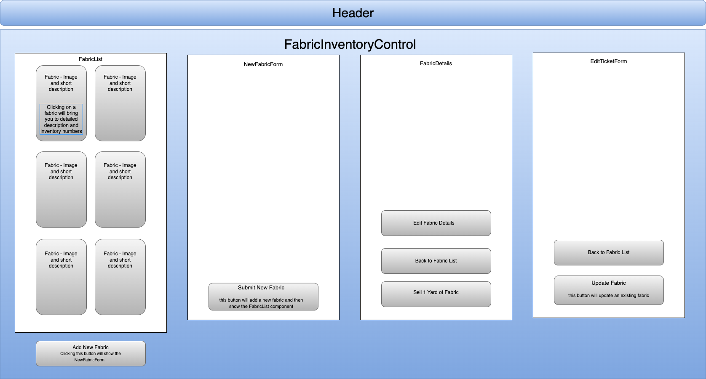

# Fabric Store Inventory Tracker

#### Welcome to the Fabric Store Inventory Tracker, a simple React application that helps you manage the inventory of fabrics in your store. This application allows you to track the available fabrics, add new fabrics to the inventory, and update the yards in stock as you sell fabric. 

#### By Suzanne Schuber

## Technologies Used

- **React**
- **Node.js**
- **npm**
- **PropTypes**
- **CSS Modules**
- **HTML5**
- **JavaScript**
- **Git and GitHub**
- **Create React App**

## Setup/Installation Requirements

To run this application locally, follow these steps:

1. Clone this repository to your local machine.
2. Navigate to the project directory `FABRIC-STORE` using your terminal.
3. Run `npm install` to install the necessary dependencies.
4. Run `npm start` to start the development server and view the application.

## Features

- View a list of available fabric types, including their descriptions, prices, extended details, yards in stock and an image.
- Add new fabric to the inventory.
- Click on a fabric to see its detail page, including the remaining yards in stock.
- Sell yards of fabric to decrement the remaining yards in stock (will not go below 0).
- Update the info on existing inventory.

## Usage

### Adding New Fabric

1. Click the "Add Fabric" button on the main page.
2. Fill out the form with the fabric's description, price per yard, details, and the number of yards to add.
3. You can also upload an image of the fabric.
4. Click the "Add Fabric" button to add the fabric to the inventory.

### Viewing Fabric Details

1. On the main page, you'll see a list of available fabrics and their details.
2. Click on a fabric to view its details, including the remaining yards in stock.
3. From the detail page, you can also sell yards of fabric or edit that fabrics details.

### Selling Fabric

1. Go to the detail page of the fabric roll you want to sell.
2. Click the "Sell Yard" button to decrement the remaining yards in stock by one.
3. The remaining yards will not go below 0.

## Component Structure

Here is a simplified diagram of the component structure of this application:

## Known Bugs

None.

## License
MIT License

Copyright (c) 2023 Suzanne Schuber

Permission is hereby granted, free of charge, to any person obtaining a copy of this software and associated documentation files (the "Software"), to deal in the Software without restriction, including without limitation the rights to use, copy, modify, merge, publish, distribute, sublicense, and/or sell copies of the Software, and to permit persons to whom the Software is furnished to do so, subject to the following conditions:

The above copyright notice and this permission notice shall be included in all copies or substantial portions of the Software.

THE SOFTWARE IS PROVIDED "AS IS", WITHOUT WARRANTY OF ANY KIND, EXPRESS OR IMPLIED, INCLUDING BUT NOT LIMITED TO THE WARRANTIES OF MERCHANTABILITY, FITNESS FOR A PARTICULAR PURPOSE AND NONINFRINGEMENT. IN NO EVENT SHALL THE AUTHORS OR COPYRIGHT HOLDERS BE LIABLE FOR ANY CLAIM, DAMAGES OR OTHER LIABILITY, WHETHER IN AN ACTION OF CONTRACT, TORT OR OTHERWISE, ARISING FROM, OUT OF OR IN CONNECTION WITH THE SOFTWARE OR THE USE OR OTHER DEALINGS IN THE SOFTWARE.